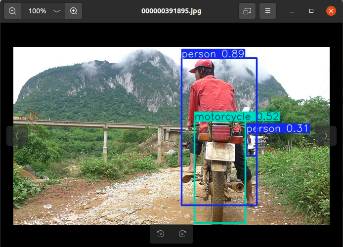
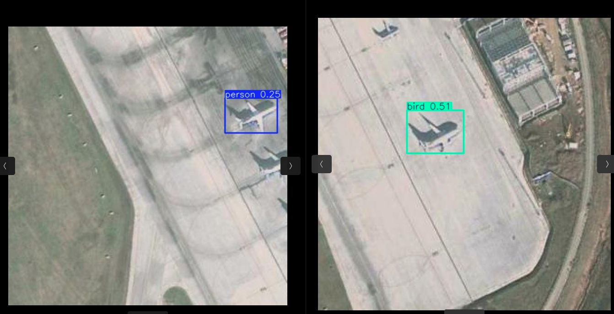
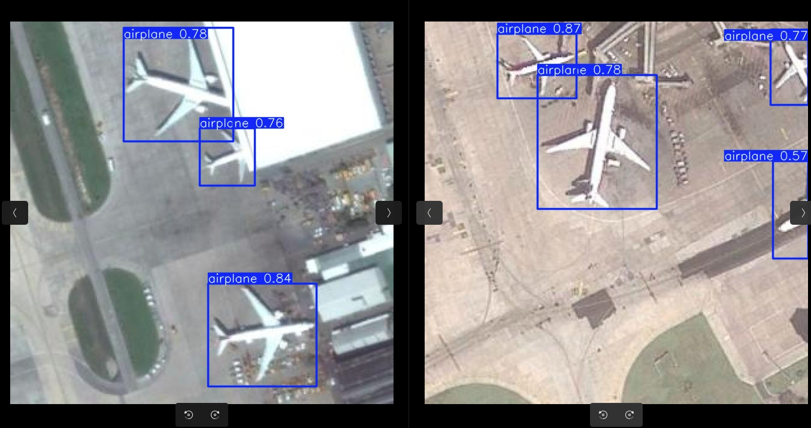
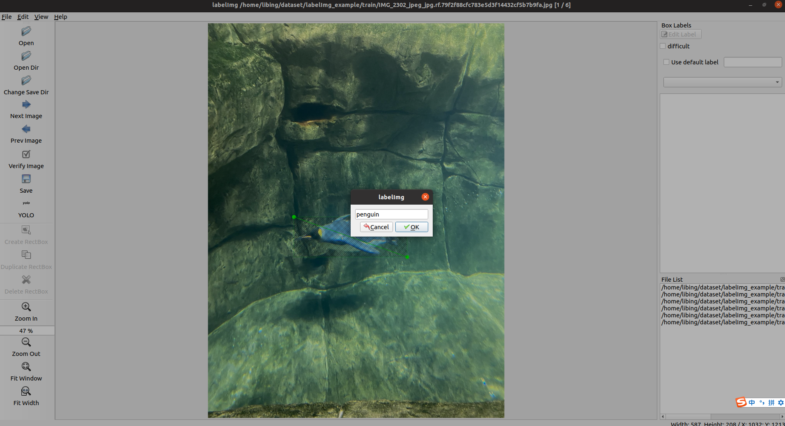
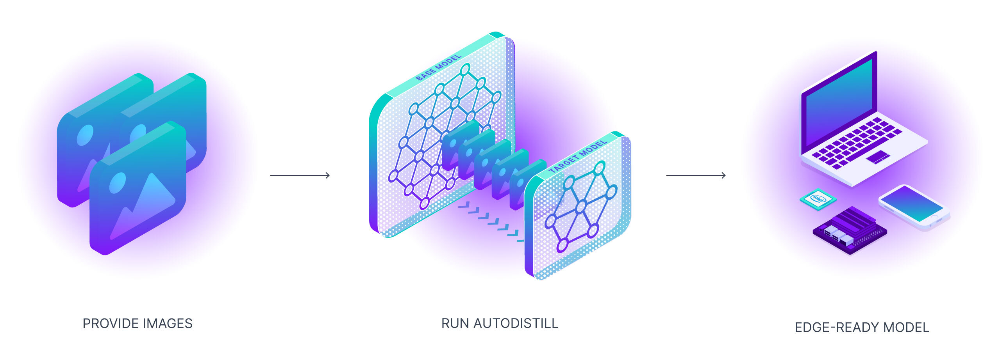

# Objection Detection 目标检测

深度学习的四要素:
* data 数据
* model 模型
* object function 目标函数
* Optimization Algorithm 优化算法
之前搞SLAM算法, 天天研究目标函数和优化算法, 但是搞深度学习要把重心放到data和model, 甚至忘掉model关注data.

最近学习完李沐老师的d2l课程, 想找些深度学习的任务做些小实验, 练练手.

* YOLO目标检测
* YOLO模型微调
* 手工标注+模型微调
* 零标注+模型蒸馏

# 1 YOLO目标检测
使用yolo训练好的模型进行目标检测, 参考https://docs.ultralytics.com/zh/tasks/detect/#how-can-i-validate-the-accuracy-of-my-trained-yolo-model

## 安装
```
conda activate -n yolo python=3.11 -y
conda activate yolo
pip install ultralytics
```
## 数据集准备 tiny_coco_dataset
```
git clone https://github.com/lizhogn/tiny_coco_dataset
```

修改yolo_object_detection.py中image_dir为你本地的tiny-coco目录

```
python yolo_object_detection.py
```


# 2 模型微调+检测
yolo在tiny-coco上检测效果好是因为coco是yolo的训练集之一, 假如你要在自己的数据集上使用yolo，就需要进行重新训练或微调(fine-tuning).

下载plane_detection dataset以yolov8格式保存, https://universe.roboflow.com/my-projects-ons8w/air-plane-detection/dataset/3
修改yolo_object_detection.py中image_dir对新数据集进行检测，大部分无法检出, 部分检测的类别也是错的。



基于plane_detection dataset进行模型微调, 注意结果权重保存路径.

```
python yolo_fine_tune.py 
```
修改权重路径和image_dir, 再次测试, 检出效果就很好了
```
model = YOLO("runs/detect/train2/weights/best.pt") 
```




# 3 手工标注+模型微调
上面使用的数据集都是已经标注好的，自己的数据集该如何标注？ dataset的格式怎样的？ 


进行目标检测数据集的标注通常需要使用专门的标注工具来标记图像中的物体，并生成相应的标注文件。以下是标注过程的基本步骤： 
 
## 3.1 选择标注工具 
 
有许多工具可以用于目标检测数据集的标注，常用的有： 
 
- **LabelImg**：一个开源的图形图像标注工具，支持生成 Pascal VOC 和 YOLO 格式的标注文件。 
- **Labelme**：一个用于图像分割和目标检测的标注工具，生成 JSON 格式的标注文件。 
- **CVAT (Computer Vision Annotation Tool)**：一个强大的在线标注工具，支持多种标注格式。 
- **VGG Image Annotator (VIA)**：一个轻量级的标注工具，可以在浏览器中运行。 
 
## 3.2 标注过程 
 
以下是使用这些工具进行标注的一般步骤： 
 
1. **安装和配置工具**：根据工具的说明进行安装和配置。 
```
pip install labelImg
```
 
2. **导入图像**：将需要标注的图像导入工具中。 
 
3. **创建标注**： 
   - 使用矩形、圆形、多边形等工具在图像上绘制边界框。 
   - 为每个标注指定类别标签。 
 

4. **保存标注**：完成标注后，将标注结果保存为所需格式（如 YOLO、Pascal VOC、COCO 等）。 
 
5. **检查和校验**：确保标注的准确性和一致性，必要时进行修改。 
 
## 3.3 标注格式 
 
根据你要训练的模型选择合适的标注格式。常见格式包括： 
 
- **YOLO 格式**：每个图像对应一个  .txt  文件，文件中每行表示一个物体，格式为  <class_id> <x_center> <y_center> <width> <height> 。 
- **Pascal VOC 格式**：以 XML 文件存储，每个图像对应一个 XML 文件。 
- **COCO 格式**：以 JSON 文件存储，适合大规模数据集。 
 
### 3.4 注意事项 
 
- **类别定义**：在开始标注前，明确需要识别的类别，并保持类别的一致性。 
- **标注质量**：确保标注的精确性和完整性，以提高模型的训练效果。 
- **数据备份**：定期备份标注数据，以防丢失。 
 
通过这些步骤，你可以创建一个高质量的目标检测数据集，为训练模型提供良好的基础。


# 4 零标注 + 模型蒸馏
如果需要训练自己的模型， 但是又不想去花钱或者花时间标注数据，一个简单的思路就是用大模型进行自动标注，然后用大模型标注的数据进行训练, autodistill就在这样的背景下出现了.

AutoDistill可以利用大型、较慢的基础模型来训练较小、更快的监督模型，使用户能够从未标记的图像直接转到在边缘运行的自定义模型上进行推断，无需人工干预。

使用 AutoDistill 的过程就像它的功能一样简单而强大。首先将未标记的数据输入基础模型。然后，基础模型使用本体来为数据集进行标注，以训练目标模型。输出结果是一个蒸馏模型，用于执行特定任务。
https://github.com/autodistill/autodistill

## 4.1 autodistill基本组件
* Base Model 基础模型：基础模型是一个大型的基础模型，比如 Grounding DINO。这些模型通常是多模式的，可以执行许多任务，通常又大又慢，而且昂贵。

* Ontology 本体：本体定义了如何提示基础模型、描述数据集的内容以及目标模型将预测什么。
  
* Dataset 数据集：这是一组可以用来训练目标模型的自动标记数据。数据集是由基础模型使用未标记的输入数据和本体生成的。

* Target Model 目标模型：目标模型是一个监督模型，用于消耗数据集并输出一个用于部署的蒸馏模型。目标模型的示例可能包括 YOLO、DETR 等。

* Distilled Model 蒸馏模型：这是 AutoDistill 过程的最终输出。它是为您的任务进行了微调的一组权重，可以用于获取预测。



## 4.2 安装
```
conda creat -n autodistill python=3.10 -y
conda activate autodistill
pip install autodistill-yolov8 autodistill-detic roboflow

```


# 大模型微调（少量样本） + 模型蒸馏